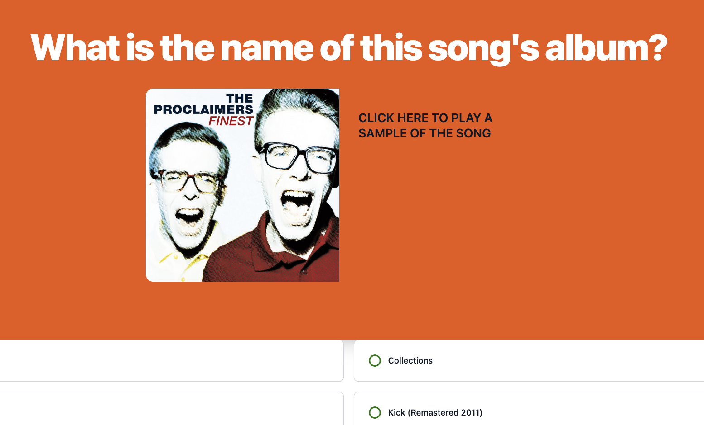

# Music Trivia App

## Description
Music Trivia App is an application that allows users to test their knowledge on music on current and past decades of music. The application was created with Tailwind CSS, Javascript/JQuery, and a Spotify API call. 

Link: https://jhan213.github.io/silver-music-trivia/

## Screenshot

